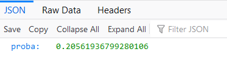

# Medical Appointment No Shows - Models and Web App

This repository contains a Jupyter notebook, the code for a web app and a Dockerfile.

The Jupyter notebook introduces the dataset and contains the modeling steps for binary a classification problem. I compare a logistic regression, random forest and XGBoost classifier.

The web app consists of a Flask backend and a Javascript frontend that serve predictions from the pickled random forest model.

The frontend looks like this:

The API will return a prediction:

Also included is a Dockerfile to download the required libraries and run the web app.

For example, to build the docker image run:
`docker build -t no-show .`

To create a container witht the web app:
`docker run -it -p 8080:8080 no-show`

The app will be available at http://localhost:8080/

The data is downloaded from kaggle, from Medical Appointment No Show case.

https://www.kaggle.com/joniarroba/noshowappointments

